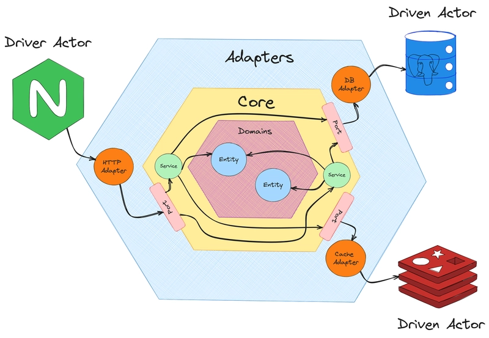

# Clean Arch API Server

## Hexagonal Architecture 



### Project Structure
```
├── bin
│   └── apiserver
├── cmd
│   ├── grpc
│   └── http
│       ├── app
│       └── main.go
├── covprofile.out
├── docker-compose.yaml
├── Dockerfile
├── docs
│   ├── docs.go
│   ├── swagger.json
│   └── swagger.yaml
├── go.mod
├── go.sum
├── internal
│   ├── adapter
│   │   ├── auth
│   │   ├── background
│   │   ├── config
│   │   ├── handler
│   │   │   ├── grpc
│   │   │   └── http
│   │   │       └── middleware
│   │   └── infra
│   │       └── mongo
│   │           └── repo
│   └── core
│       ├── domain
│       ├── port
│       ├── service
│       └── util
├── readme
├── README.md
└── Taskfile.yml
```

- **docs**: directory to store project's documentation, such as swagger static files.
- **cmd**: directory for main entry points or commands of the application. The http sub-directory holds the main HTTP server entry point.
- **internal**: directory for containing application code that should not exposed to external packages.
  - **core**: directory that contains the central business logic of the application. Inside it there are 4 sub-directories.
  - **domain**: directory that contains domain models/entities representing core business concepts.
  - **port**: directory that contains defined interfaces or contracts that adapters must follow.
  - **service**: directory that contains the business logic or services of the application.
  - **util**: directory that contains utility functions that reused in the service package.
- **adapters**: directory for containing external services that will interact with the core of application.
- **handler/http**: directory that contains HTTP request and response handler.
- **infra/mongo**: directory that contains database adapters for MongoDB.

## 1. Project Setup and Run Instructions

### Prerequisites
- Go 1.21 or newer
- Docker (for MongoDB, optional)
- Make or Taskfile (optional, for easier commands)

### Clone the Repository
```zsh
git clone <your-repo-url>
cd clean-arch
```

### Install Dependencies
```zsh
go mod tidy
```

### Start MongoDB (with Docker)
```zsh
docker-compose up -d
```

### Generate Wire Injectors (if you change DI wiring)
```zsh
wire ./cmd/http/app

# or 

task g
```

### Run the API Server

#### Build and run

Run directly with go
```zsh
go run cmd/http/main.go
```

Or build and run:
```zsh
go build -o bin/apiserver cmd/http/main.go
./bin/apiserver
```

Or run with hot reload refer to [Dev Tools Air](#air)

```zsh
$ air
# or
$ task
```


### API Documentation
- Swagger UI: [http://localhost:8080/swagger/index.html](http://localhost:8080/swagger/index.html)

---

## 2. JWT Token Usage Guide

- After a successful login (`POST /v1/auth/login`), you will receive a JWT token in the response.
- For all protected endpoints, include the token in the `Authorization` header:

```
Authorization: Bearer <your-jwt-token>
```

- The token is signed using the secret in your config (`JWT_SECRET`).
- The token expires after the duration set in your config (`DURATION`).

---

## 3. Sample API Requests/Responses

### Register a User
**Request:**
```
POST /v1/users/register
Content-Type: application/json

{
  "name": "John Doe",
  "email": "john@example.com",
  "password": "password123"
}
```
**Response:**
```
{
  "id": "...",
  "name": "John Doe",
  "email": "john@example.com"
}
```

### Login
**Request:**
```
POST /v1/auth/login
Content-Type: application/json

{
  "email": "john@example.com",
  "password": "password123"
}
```
**Response:**
```
{
  "token": "<jwt-token>"
}
```

### Get User List (Protected)
**Request:**
```
GET /v1/users?page=1&size=10
Authorization: Bearer <jwt-token>
```
**Response:**
```
{
  "meta": {
    "total": 1,
    "page": 1,
    "size": 10
  },
  "data": [
    {
      "id": "...",
      "name": "John Doe",
      "email": "john@example.com"
    }
  ]
}
```

### Get User by ID (Protected)
**Request:**
```
GET /v1/users/{id}
Authorization: Bearer <jwt-token>
```
**Response:**
```
{
  "id": "...",
  "name": "John Doe",
  "email": "john@example.com"
}
```

---

For more endpoints and details, see the Swagger UI or the `internal/adapter/handler/http` package.

## 5. Dev Tools

### Air
[Air](https://github.com/air-verse/air) is an automatic reloading tool for Go applications. It keeps an eye on code changes and automatically restarts the application, making development more efficient.

### Taskfile
[ Taskfile ](https://taskfile.dev/) is a tool for streamlining repetitive development tasks. It helps automate activities like building, testing, and deploying applications. Unlike [Makefile](https://makefiletutorial.com/#why-do-makefiles-exist), Taskfile uses YAML for configuration, making it more readable and user-friendly.

### Swaggo
[Swaggo](https://github.com/swaggo/swag) is a tool that creates Swagger documentation for Go APIs. It makes documenting API endpoints easier, helping developers understand and use the API.

### Github Actions
[GitHub Actions](https://github.com/features/actions) is a platform linked with GitHub repositories for automating tasks like building, testing, and deploying applications. It simplifies development and ensures code quality.


